# ADA-Grade SwiftUI Design Skill

A design-doctrine skill that makes coding agents (Claude, Claude Code, Cursor)
produce SwiftUI interfaces that look designed, not generated — distilled from
visual analysis of **Apple Design Award winners and finalists 2022–2025** and
Apple's official judging language across all six award categories.

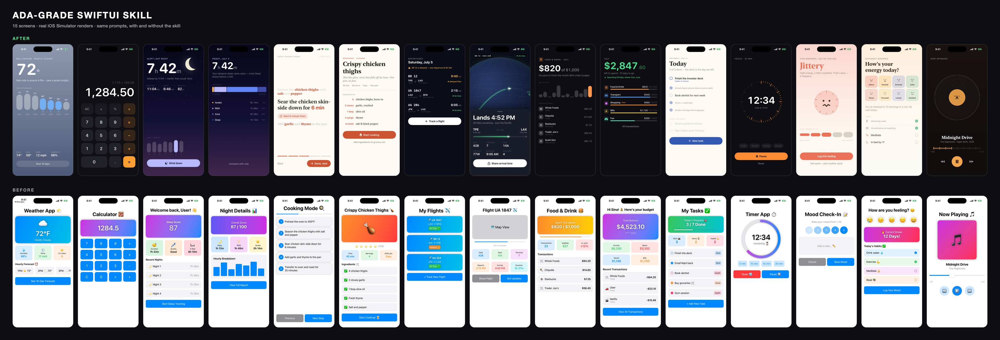

*Eight domains, one doctrine — every image in this repo is a real iOS Simulator render. No mockups.*

## Benchmark results: this skill vs. 3 real SwiftUI design skills

The full competitor comparison is complete and lives in [`benchmark/`](benchmark/). It includes
**10 briefs × 5 variants = 50 standalone SwiftUI apps**, all compile-verified and rendered from
real iOS Simulator screenshots. The compared variants are: baseline/no guidance, trilliwon SwiftUI
Cursor rules, harperhhh swiftui-design skill, wshobson mobile-ios-design skill, and this ADA skill.

**Result:** ada scores **13.6/14 mean** vs. **7.1/14** for the strongest competitor.

| baseline | trilliwon | harperhhh | wshobson | **ada** |
|---|---|---|---|---|
| 2.5 | 6.1 | 6.3 | 7.1 | **13.6** |

Jump straight to:
- [`benchmark/README.md`](benchmark/) — rendered GitHub landing page for the full comparison
- [`benchmark/COMPARISON.md`](benchmark/COMPARISON.md) — complete score table + all 50 screenshots
- [`benchmark/screenshots/`](benchmark/screenshots/) — raw simulator renders
- [`benchmark/generated/`](benchmark/generated/) — all 50 generated SwiftUI source files

Example benchmark row:

| baseline | trilliwon | harperhhh | wshobson | **ada** |
|---|---|---|---|---|
| 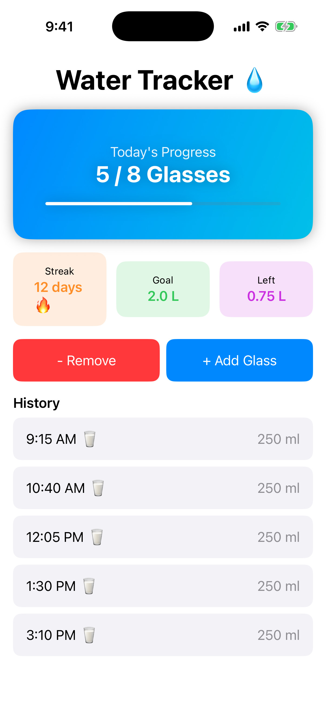 | 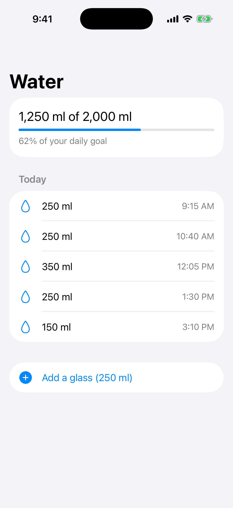 | 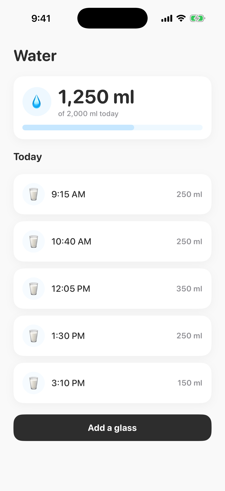 | 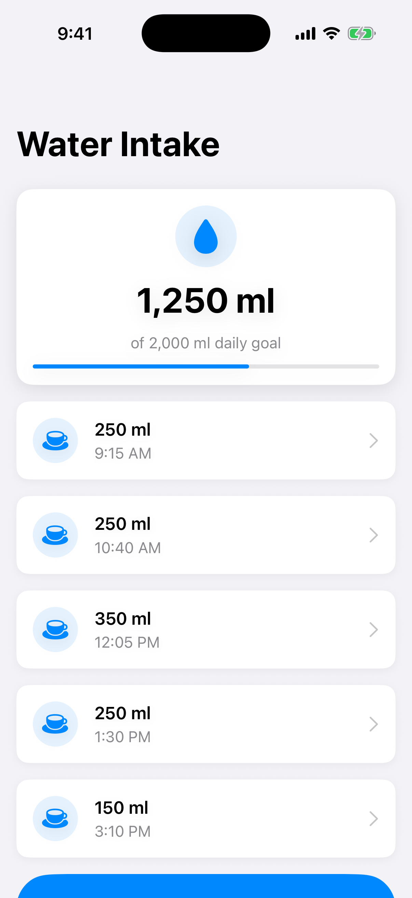 | 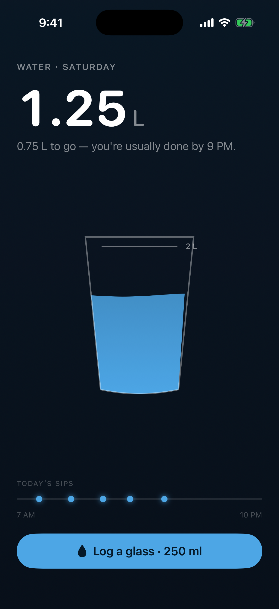 |

## What's in the skill

Not a theme — a process. The short version:

- **Step 0** — four questions before any code: the screen's single QUESTION, the
  domain's METAPHOR, the emotional TEMPERATURE, and the STAGE (does this domain
  have a *place*?).
- **The Eleven Rules** — one hero per screen; color as information only;
  background-as-state; typography doing the layout's work; numerals as heroes;
  contextual dimming; physical-or-stock controls; motion as physics; human
  voice; **draw the scene (and the scene is the screen, not a widget on it)**;
  structural accessibility.
- **Architecture doctrine** — immersive world + floating surfaces / scroll
  narrative / flat page, with named anti-patterns (the aquarium, the
  well-dressed spreadsheet, naked stats over scenery).
- **Zero-asset scene recipes** — seeded procedural Canvas drawing (clouds, star
  fields, terrain), pseudo-3D globes from gradients + graticules, journey arcs
  with subjects at real progress, faces-as-geometry.
- **A self-scoring pre-flight checklist** the agent must pass before answering.

The full skill: [`SKILL.md`](SKILL.md)

## Before / after

Same prompts, same model. The only difference is the skill.

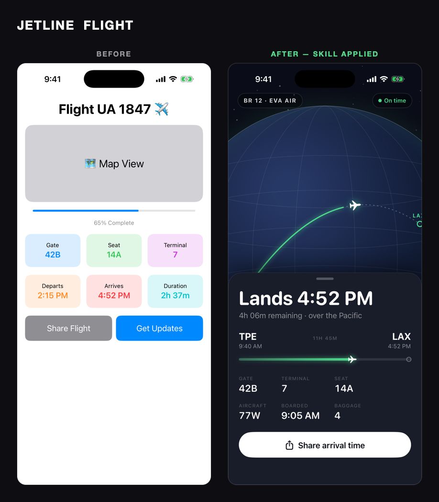
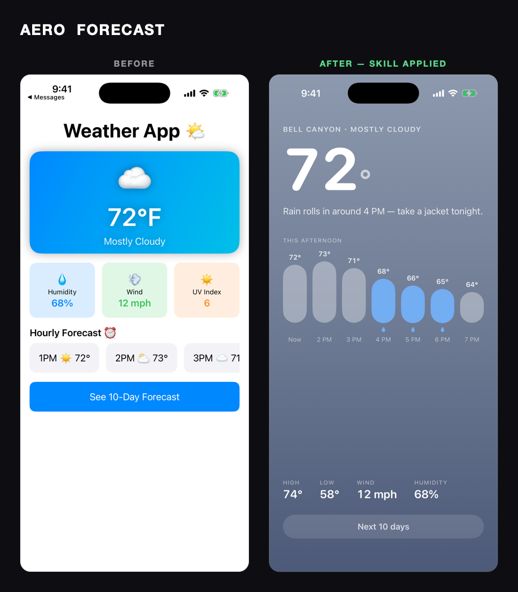
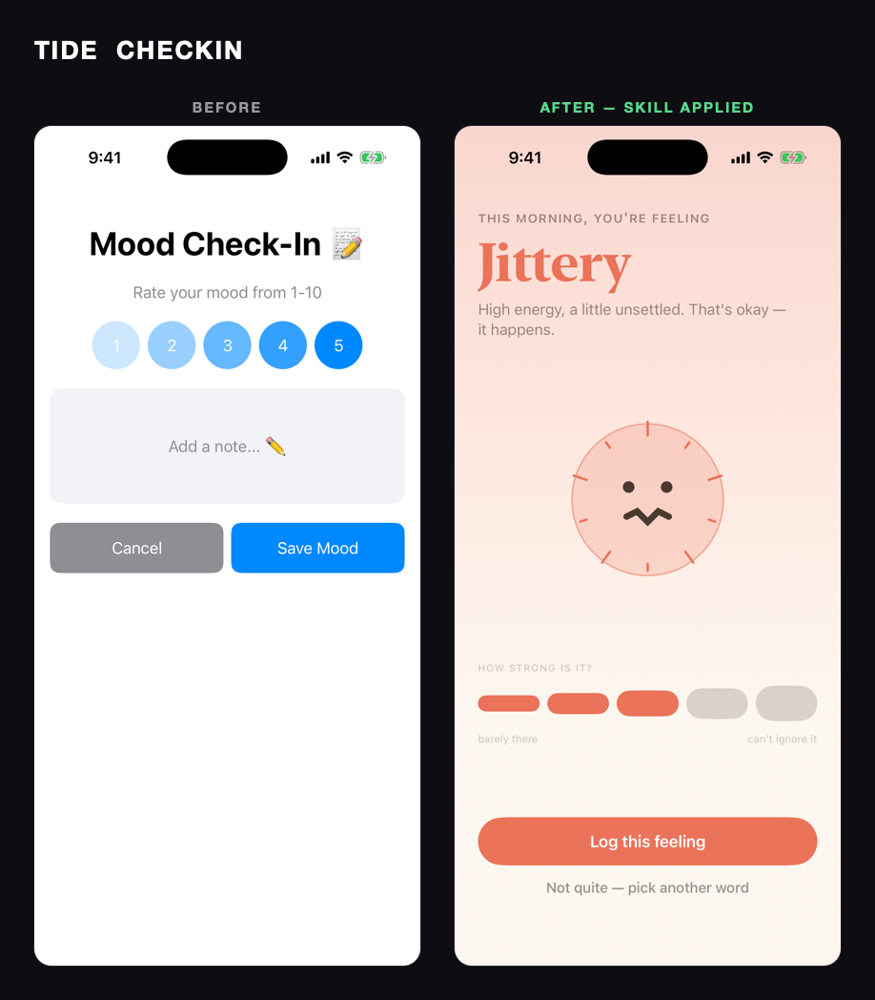
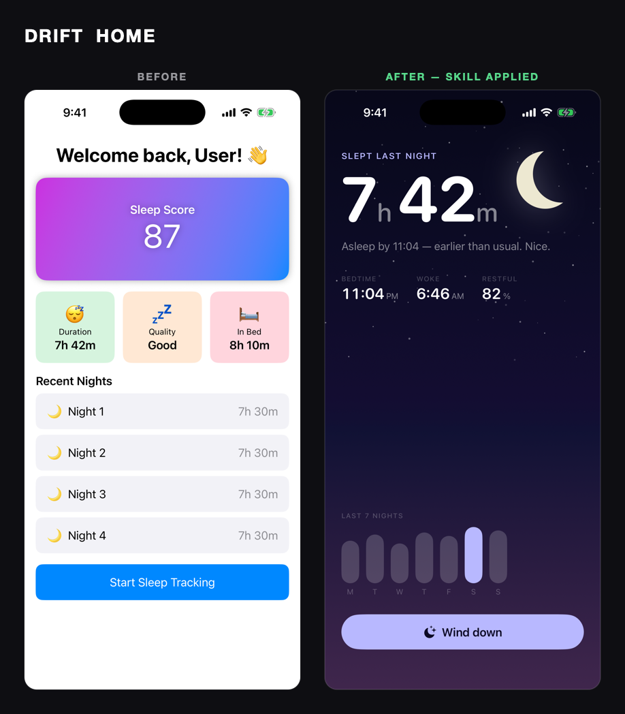

All 15 pairs: [`renders/collages/`](renders/collages/) · sources:
[`examples/before-after/`](examples/before-after/)

## Gallery — 8 domains, one doctrine

| | | | |
|---|---|---|---|
| 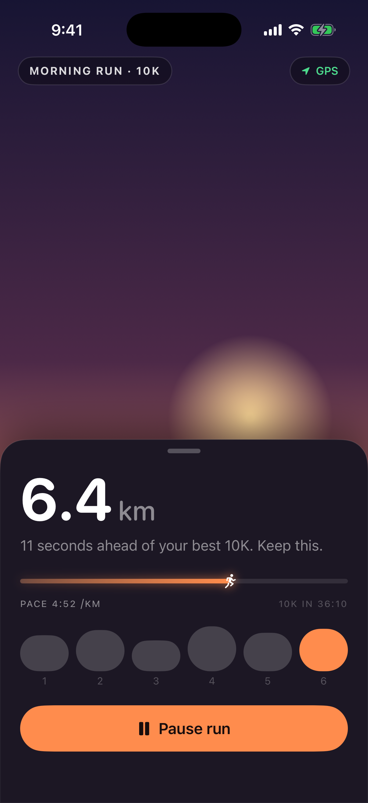 | 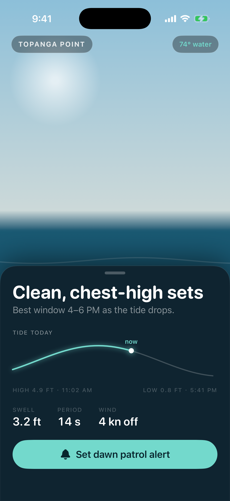 | 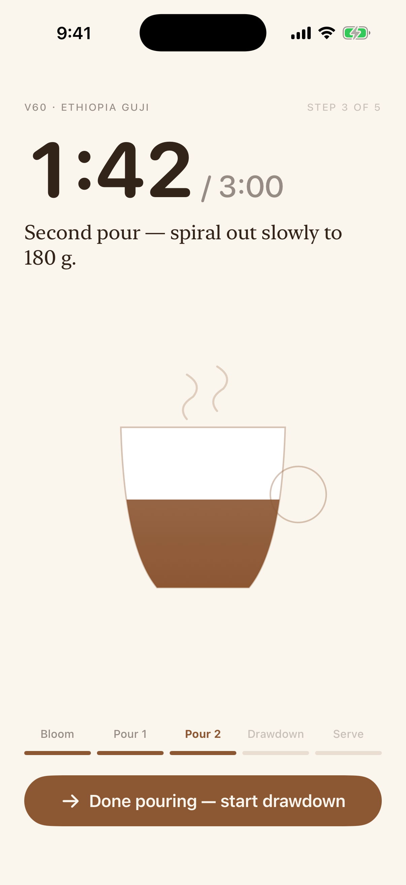 | 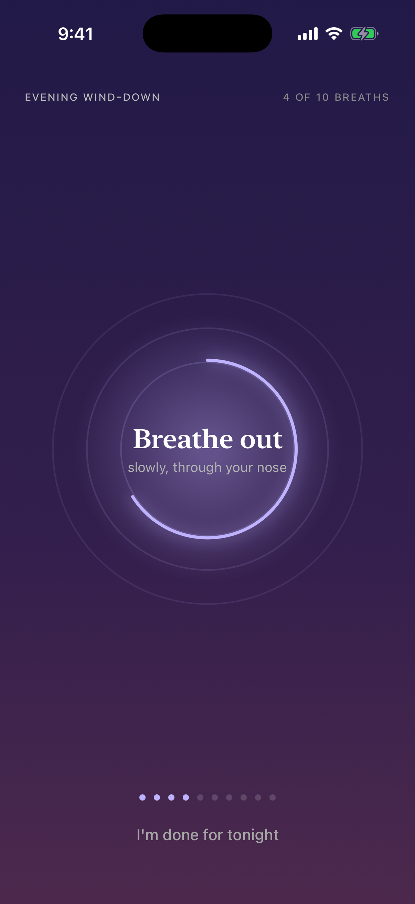 |
| 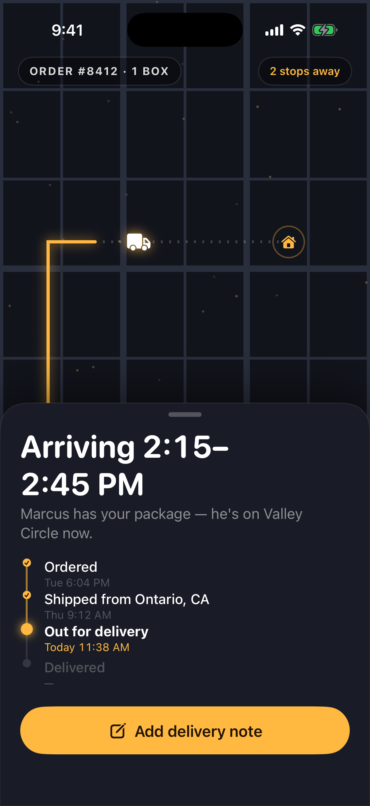 | 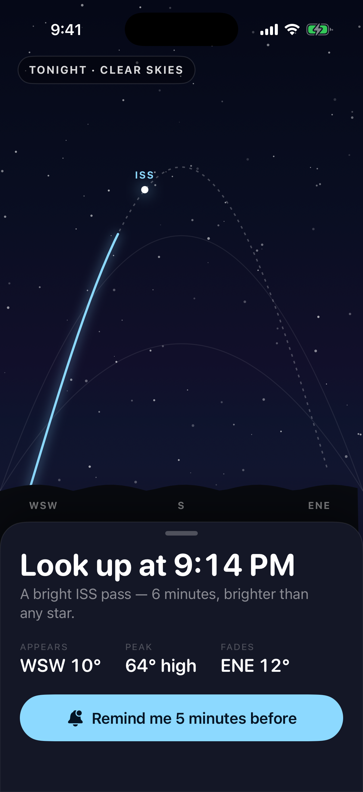 | 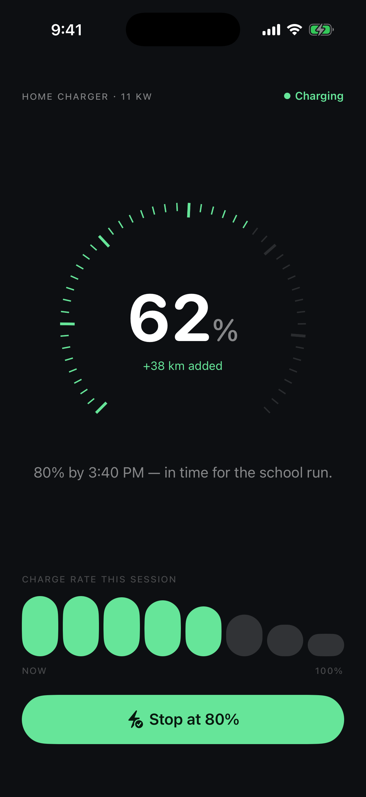 | 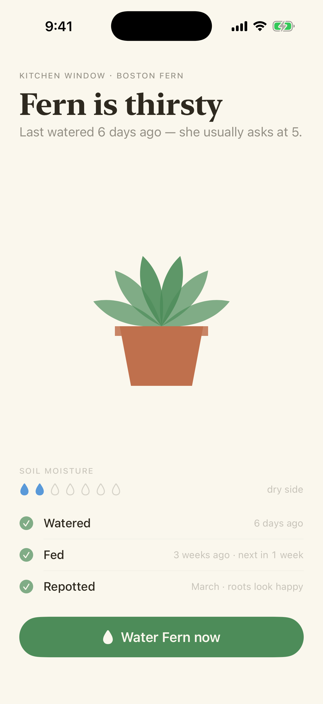 |

Sources: [`examples/gallery/`](examples/gallery/)

## Use it

**Claude Code / Claude:** paste `SKILL.md` into your project as a skill or
include it in context when asking for SwiftUI UI.

**Cursor:** drop the body of `SKILL.md` into `.cursor/rules/swiftui-design.mdc`.

## Reproduce the renders

Requires Xcode + an iOS Simulator runtime (macOS).

```bash
# 15 before/after pairs + collages
bash examples/before-after/run.sh

# 8-domain gallery
bash examples/gallery/run-gallery.sh
```

Both scripts compile the sources with `swiftc` against the iphonesimulator SDK,
boot a simulator headless, capture real screenshots, and composite collages with
a dependency-free CoreGraphics tool.

## Benchmark vs. 3 real competitor skills — results included

[`benchmark/COMPARISON.md`](benchmark/COMPARISON.md) — **10 briefs × 5 variants,
all 50 apps in [`benchmark/generated/`](benchmark/generated/), all compile-verified.**
Competitors pinned verbatim with sources in [`benchmark/competitors/`](benchmark/competitors/):
trilliwon's SwiftUI Cursor rules, harperhhh's swiftui-design skill (LobeHub), and
wshobson's mobile-ios-design HIG skill.

| Variant | Mean score /14 | Character |
|---|---|---|
| baseline (no guidance) | 2.5 | gradient-card slop, emoji icons, rainbow stat boxes |
| trilliwon rules | 6.1 | clean architecture, zero visual opinion — ten settings screens |
| harperhhh skill | 6.3 | consistent pastel cards, domain-blind, color = mood not meaning |
| wshobson HIG skill | 7.1 | native-correct, converges everything to the same card list |
| **ada (this skill)** | **13.6** | scene centerpieces encoding real state, heroes, semantic color |

Render the 50 side-by-side screenshots yourself:

```bash
bash benchmark/render-bench.sh   # builds all 50, captures real simulator shots, opens RESULTS.html
```

Want to re-run the whole experiment from scratch (fresh competitor research,
fresh generations)? [`claude-code/BENCHMARK_PROMPT.md`](claude-code/BENCHMARK_PROMPT.md)
is a ready-to-paste Claude Code prompt that reproduces the full pipeline with
parallel, contamination-free subagents and blind scoring.

## Evals

[`evals/EVALS.md`](evals/EVALS.md) — 7 scored dimensions (hero clarity, color
discipline, typography, metaphor, voice, motion/haptics, accessibility) with
automatic caps for banned-list violations and a compile gate. Reference scores
included for every example in this repo.

## Research basis

Winner lists, category justifications, and press analysis for ADA 2022–2025 were
collected from Apple's newsroom/developer pages and coverage (MacStories,
TechCrunch, 9to5Mac), then ~20 winning apps' App Store screenshots were visually
analyzed for recurring craft patterns (Lumy's sky-as-data, Mela's cooking-mode
dimming, Copilot's instrument-panel numerals, Flighty's airport signage, How We
Feel's color-as-emotion, Watch Duty's crisis hierarchy, and more). The doctrine
generalizes those patterns; it never copies an app.

## License

MIT
